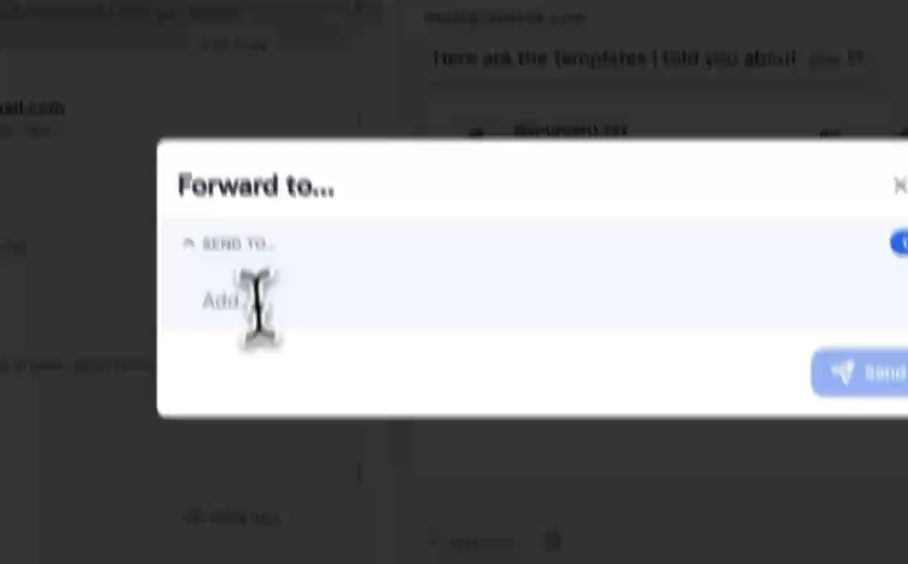
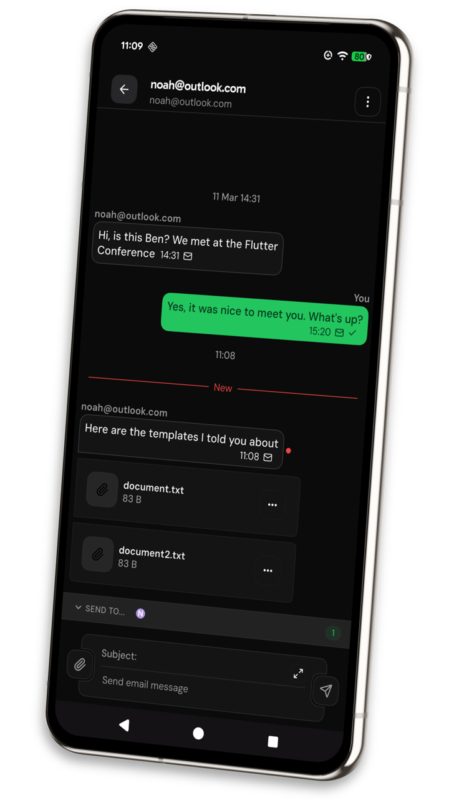
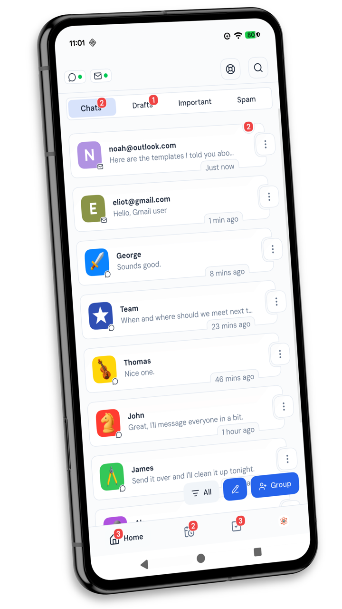
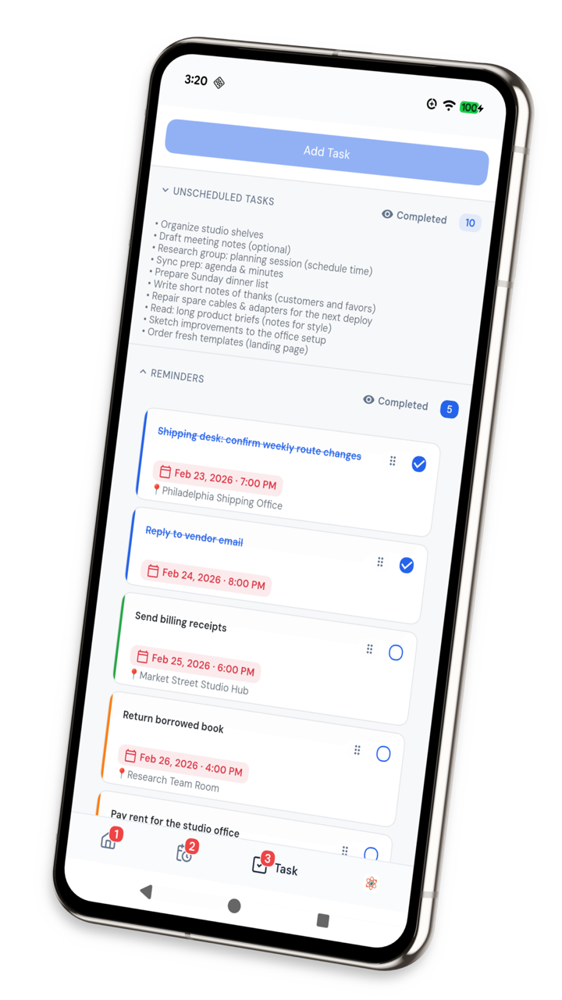
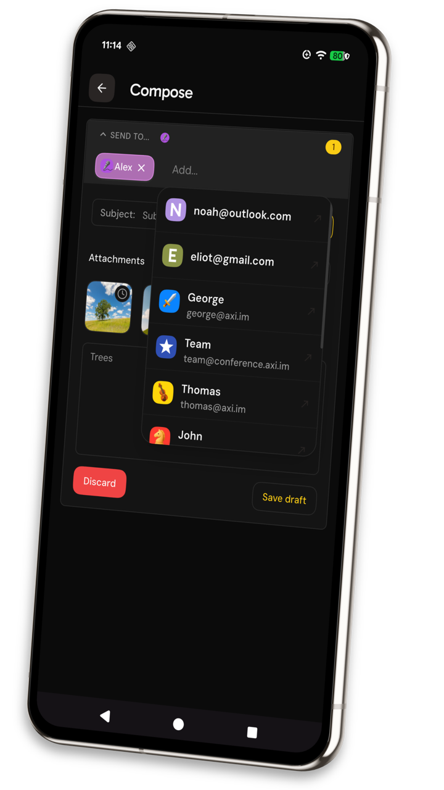
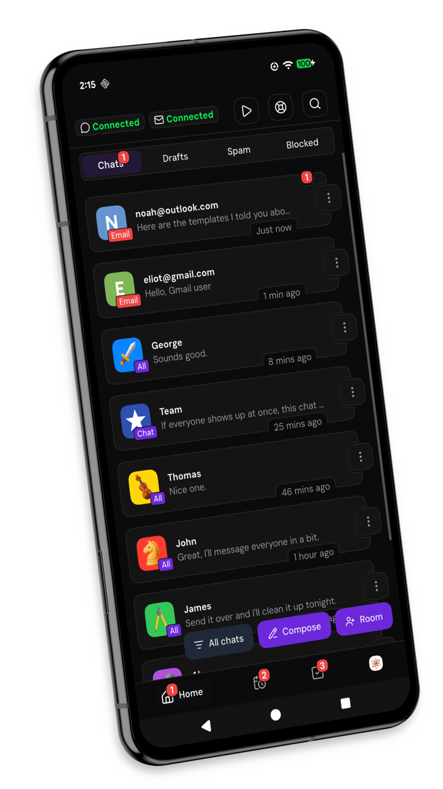
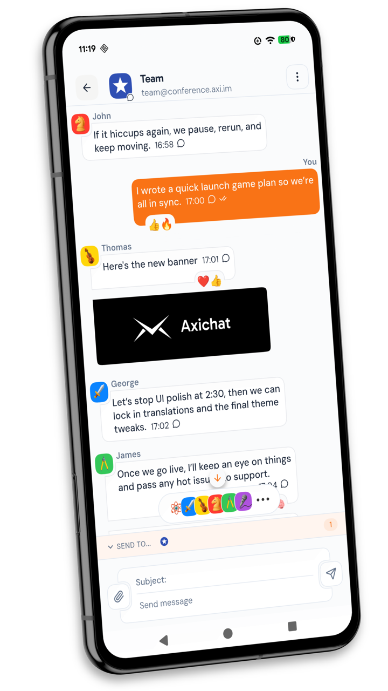

  

  <h2>The best of instant messaging, email, and calendar all in one.</h2>

  
<strong>Warning:</strong> Axichat is under active development, so things may break.

  
<a href="https://axi.chat"><strong>Visit the website: axi.chat</strong></a>

  
<a href="assets/readme/Axichat_demo_24fps.mp4"><strong>Watch the Axichat demo video (MP4)</strong></a>

  
  
<em>Click the preview to play/download the MP4.</em>

  
  
  

## Screenshots

  
<strong>Breeze through email like you're texting</strong>

<table width="100%">
  <tr>
    <td width="50%" align="center">
      
    </td>
    <td width="50%" align="center">
      
    </td>
  </tr>
</table>

  
<strong>Schedule your weeks in minutes</strong>

<table width="100%">
  <tr>
    <td width="50%" align="center">
      
    </td>
    <td width="50%" align="center">
      
    </td>
  </tr>
</table>

  
<strong>Reach anyone, even if they don't use Axichat</strong>

<table width="100%">
  <tr>
    <td width="50%" align="center">
      
    </td>
    <td width="50%" align="center">
      
    </td>
  </tr>
</table>

### Feature highlights:

- 1st-party push notifications and offline sync
- Unified inbox for chat + email side by side
- Group chats and per-conversation settings
- Easy forwarding and replying
- Emoji reactions
- Delivery and read receipts with typing indicators
- Stream management with automatic reconnect to stop messages dropping
- Upload your own avatar or use one of our cool defaults
- Message drafts, starred items, and pinned messages
- Rich attachments and inline previews
- Fast search across chats, mail, and calendar
- Collaborative calendars with per-event permissions and owner/assignee roles
- Availability sharing that shows overlaps before you schedule
- Natural-language scheduling with drag+drop calendar editing
- One-tap add-to-calendar from simple text messages
- Tasks, reminders, and calendar in one view
- Calendar export/import for backups and migrations
- Critical paths and agenda focus to surface what’s next
- Accessibility-friendly modals and flows (keyboard/touch/reader aware)
- Translated UI (English, Spanish, German, French, Chinese)
- Dark and light modes with brand color schemes
- Sync across all your devices (Android, Linux, Windows)
- Desktop + mobile parity with keyboard shortcuts and touch affordances
- Smart notifications (muting, per-chat overrides, do-not-disturb)
- Works without Google/Firebase; pure XMPP + SMTP/IMAP core

## Roadmap

### Completed

- [x] 2024: Core XMPP messenger foundation (presence, chat, open-protocol architecture)
- [x] 2024: First-party notifications and offline-friendly messaging baseline
- [x] 2025: Cross-platform desktop/mobile support (Android, Linux, Windows)
- [x] 2025: Calendar + task system foundation (natural-language scheduling and drag/drop planning)
- [x] 2025: Unified email integration via DeltaChat Core Rust
- [x] 2025: Group chats (MUC) and richer conversation UX (receipts/reactions/reply flows)
- [x] 2025: File attachments and media sharing in chat/email flows
- [x] 2025: Shared availability and collaborative calendar workflows

### Upcoming

- [ ] 2026: Voice and video calling
- [ ] 2026: End-to-end encryption
- [ ] 2026: 3rd-party email OAuth
 

 

  
<strong>If you're proactive and busy, you'll love Axichat both because of what it has and what <em><strong>it doesn't have</strong></em>.</strong>

<table>
  <tr>
    <th>What Axichat Offers</th>
    <th>What We Avoid</th>
  </tr>
  <tr>
    <td>
      <ul>
        <li>Chat and email unified, providing the best of both worlds</li>
        <li>World's best calendar, for free</li>
        <li>Share mutual availability to book meetings without back-and-forth</li>
        <li>Unique, state-of-the-art UI</li>
        <li>Native performance on every platform</li>
        <li>1st party push notifications</li>
        <li>Offline functionality</li>
      </ul>
    </td>
    <td>
      <ul>
        <li>Proprietary dependencies</li>
        <li>Trackers</li>
        <li>Vendor lock-in</li>
        <li>Sharing/selling ANY data</li>
        <li>Centralized servers</li>
        <li>3rd party push notifications</li>
      </ul>
    </td>
  </tr>
</table>

## Why?

**Email sucks and most XMPP clients neglect UX**

- **Tools matter** - Would you rather write a letter while standing up outside or sitting at your
  desk? Using the right software makes the same difference. Axichat is a digital desk for your
  online communication.
- **Time matters** - You can always make more money, but not more time. Axichat's calendar is
  designed to help you seize the day, and our chat-like email formatting helps you avoid spending it
  reading what you don't want to, retyping information, opening the wrong emails, and spamming
  alt+tab.
- **Collaboration matters** - Share availability, co-edit events, and resolve scheduling overlaps
  together so everyone stays aligned.

## What?

**Built on XMPP and SMTP**

### Best chat interface:

- Get Axichat's cutting-edge UI, even if your recipients are not on Axichat yet.
- Read and send emails+attachments using our stunning chat interface no matter where your recipients
  are: Gmail, Outlook, Tuta, etc.
- When talking to someone also on Axichat, get extra features: Groupchats, Reactions, Delivery
  Receipts, and more.

### Best calendar in the world:

- Natural language parsing (without any AI) so you can just type in what, when, how long, how often,
  due by, and more in any way you want and the calendar will automatically schedule it into the grid
  for you. Don't worry about tweaking 30 different inputs to plan a basic task.
- If you don't know when it needs to get done, that's fine; we just put it in the unscheduled list
  so you can quickly and easily dump your stream-of-consciousness.
- If it has a deadline then we will notify you when it is getting close.
- Excellent for planning your entire personal routine, featuring a built-in Eisenhower Matrix so you
  can put first things first.
- Intuitive UI/UX that works seamlessly on every screen with drag+drop to reschedule, drag to
  resize, copy+paste, batch edit, and much more.
- Available in Guest Mode so you don't even need an account or internet to use it.
- Scheduling, task management, and reminders all in one place with natural language processing (no
  AI) for frictionless use.

## When?

- Development started in 2024

## Where?

- Built in New Zealand

## Who?

- For people with a lot to get done
- For people who want to take control of their communications and time

## How?

- Written in Dart + Flutter
- With Moxxmpp, DeltaChat Core Rust, Drift

## Downloading & Installing

1. Pick the platform button above (APK, Windows `.zip`, or Linux `.tar.gz`).
2. Verify the checksum/signature provided in the GitHub Release notes.
3. Install:
    - **Android** – Sideload the APK or deploy through your preferred device manager.
    - **Windows** – Extract the archive and run `Axichat.exe`.
    - **Linux** – Extract into a directory and launch `./axichat` (see `linux/axichat.desktop` for
      desktop entry guidance).

## License

Axichat is licensed under the GNU Affero General Public License v3.0 or later
(AGPL-3.0-or-later). See `LICENSE.txt`. Corresponding source is available at
https://gitlab.com/axichat/axichat.
